### Deployment instructions
to replicate this - you would need AWS credentials to setup backend and logging in a new s3 bucket (i didn't have to move from aws s3 to digital ocean spaces or yandex bucket). Search for s3 references in the code and update appropriately. Trained_models folder and videos on how to deploy this app are available here: s3://arn:aws:s3:eu-central-1:388062344663:accesspoint/yc-project 

### Prerequisites: 
* yc-cli
* kubectl
* ansible
* terraform
* git
* docker, docker-compose
* python3.10
* ssh key
* aws credentials for s3 bucket
```
git clone http://github.com/arybach/slackfastapi
cd slackfastapi/terraform
terraform init
terraform apply -var-file=terraform.tfvars -auto-approve
terraform output -json > ../ansible/terraform_outputs.json
cd ../ansible
ansible-playbook fetch-creds-yc.yml
# for digital ocean:
cd slackfastapi/terraform/digitalocean
terraform init
terraform apply -var-file=terraform.tfvars -auto-approve
terraform output -json > ../../ansible/terraform_outputs.json
```
### Yandex - open web UI, create managed gitlab service
### Digitalocean: follow instructions (check for root password in e-mail, ssh into a vm, ufw allow 5050/tcp
ufw allow OpenSSH, edit gitlab.rb, run gitlab-ctl reconfigure, etc.)
*** https://www.digitalocean.com/community/tutorials/how-to-use-the-gitlab-enterprise-edition-1-click-install-on-digitalocean ***

```
cd ../../ansible
ansible-playbook fetch-creds-do.yml
```
### update DNS records in Yandex web UI or in DO web UI
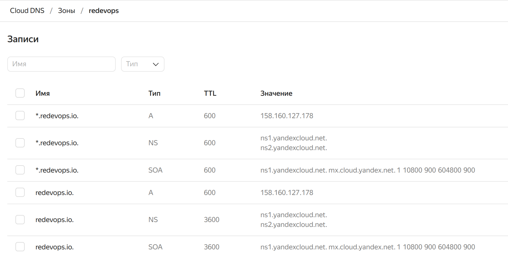

### when images are built - to quickly deploy code to k8s
```
cd ../slackfastapi-master
kubectl create namespace slack-fastapi
kubectl apply -f deploy/kube
```
### otherwise: create managed Gitlab instance via yandex UI
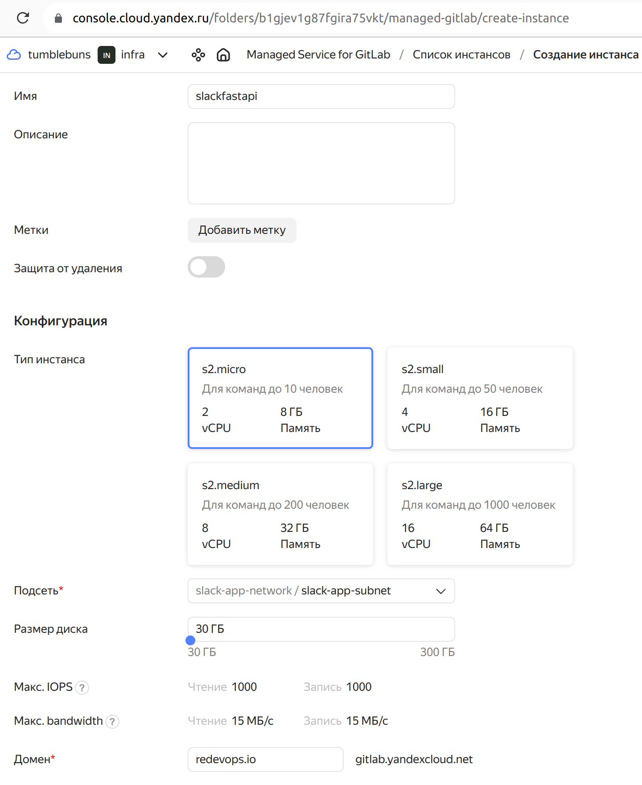
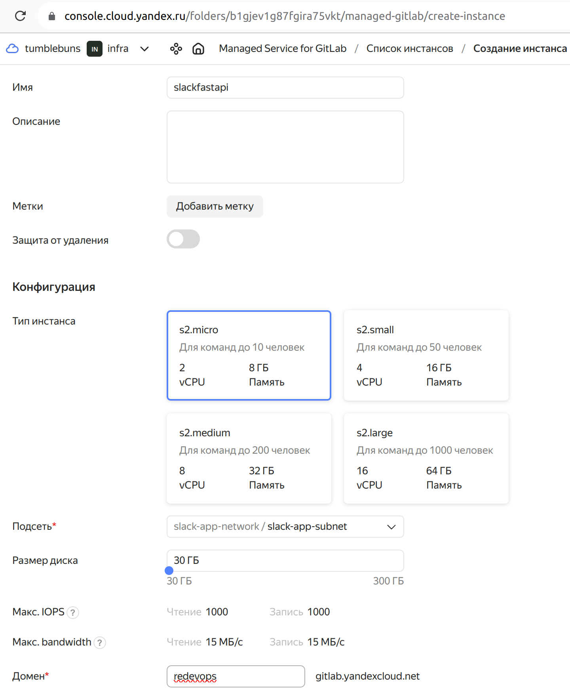

### login using reset link sent to the email provided at Gitlab instance creation
### then create group and new project
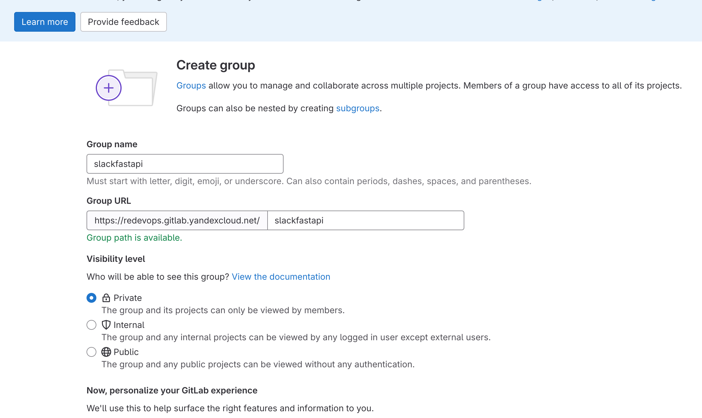

### Then under Settings -> CI/CD -> expand variables and add env vars (non-sensitive vars are set in .env file for development) and then EXPORT them on a localhost for ansible to create kubernetes secrets:
```
# these values are an example, modify them to proper secrets (should be unmasked and unprotected for tests to run)

SLACK_FASTAPI_DB_USER="slack_fastapi" 
SLACK_FASTAPI_DB_PASS="slack_fastapi"

POSTGRES_USER="slack_fastapi" 
POSTGRES_PASSWORD="slack_fastapi"

RABBITMQ_USER="apiuser"
RABBITMQ_PASSWORD="apipass"

# AWS credentials are REQUIRED for videos to be saved! (should be masked and protected)
AWS_ACCESS_KEY_ID=""
AWS_SECRET_ACCESS_KEY=""
```
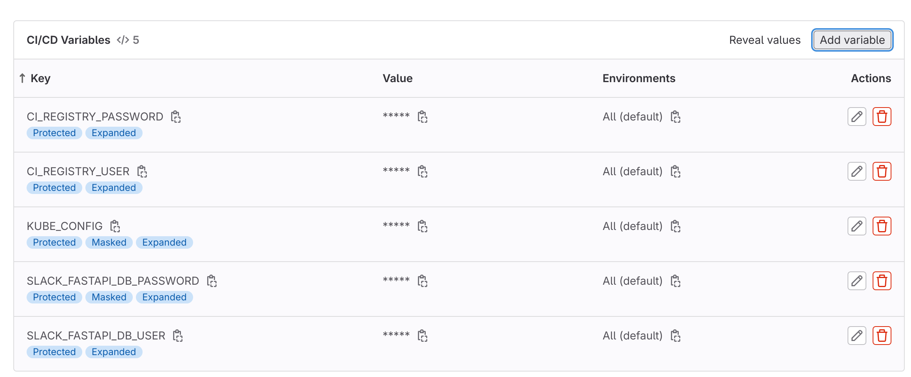

### Create new project for the group (ADD ssh key via Gitlab UI) + add ssh key to it


### Under project -> Settings -> CICD ->  Runners -> create new project runner (specify tags!):
```
# it will produce command like this:
gitlab-runner register  --url https://redevops.gitlab.yandexcloud.net  --token glrt-token

export GITLAB_RUNNER_TOKEN=glrt-token

# modify gitlab-runner-values.yml and deploy-runner.yml to use correct domain name, then run:
cd ../ansible
ansible-playbook deploy-runner.yml

# check runner's pod logs in gitlab namespace to make sure it's ok and run:
kubectl auth can-i create deployments --as=system:serviceaccount:gitlab:default -n slack-fastapi
# should return - yes
```
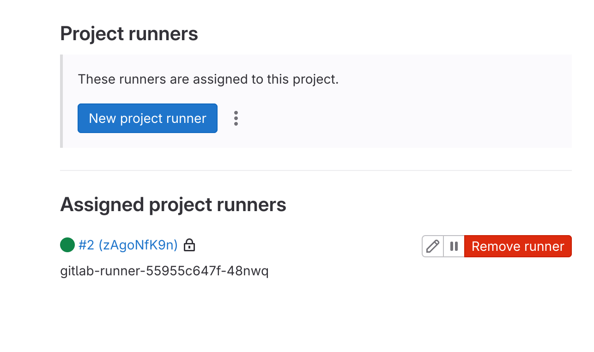
### under project -> Settings -> CI/CD -> Runners click on the newly registered runner to edit:
### add tags: docker-runner, kubernetes-runner, deploy-runner (these are added by default in gitlab-runner-values.yml)
```
# under project -> Operate -> Kubernetes Clusters -> Connect a Cluster -> start typing the name of the agent you want to create -> then click on create agent, when it appears as an option -> Register

export GITLAB_AGENT_TOKEN=glagent-token

# modify deploy-agent.yml to use correct domain name, then run:
ansible-playbook deploy-agent.yml
```
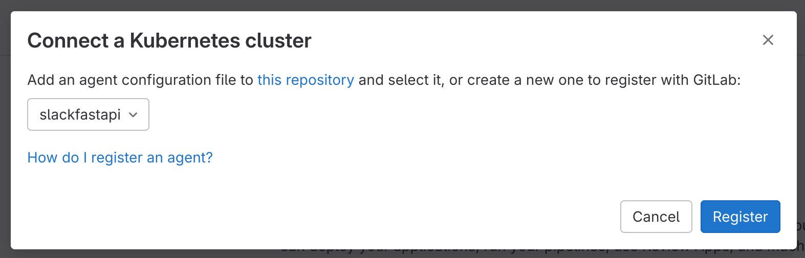

### add env var KUBE_CONTEXT=slackfastapi/slackfastapi:slackfastapi (group_name/subgroup_name/project_name:agent_name), although it works fine without it
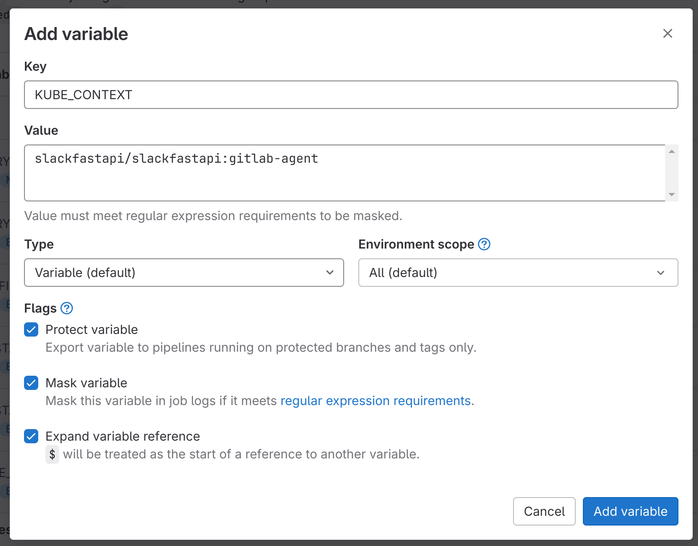

### before pushing to gitlab - under Settings -> Access Tokens -> create new Project Access Token - called 'container_registry' with read/write rights to container registry, repository and api, then create kubectl secret:
```
export GITLAB_ACCESS_TOKEN=glpat-token
```
### then run create secrets to pass envs into kubernetes secrets
```
ansible-playbook create-env-secrets.yml
```
# link to repo (just in case)
https://redevops.gitlab.yandexcloud.net/slackfastapi/slackfastapi/-/settings/repository

# SET protected variables:
```
CI_REGISTRY=redevops.gitlab.yandexcloud.net:5050
CI_REGISTRY_USER=container_registry
CI_REGISTRY_PASSWORD=glpat-token
```
### this is full set of variables defined for the project
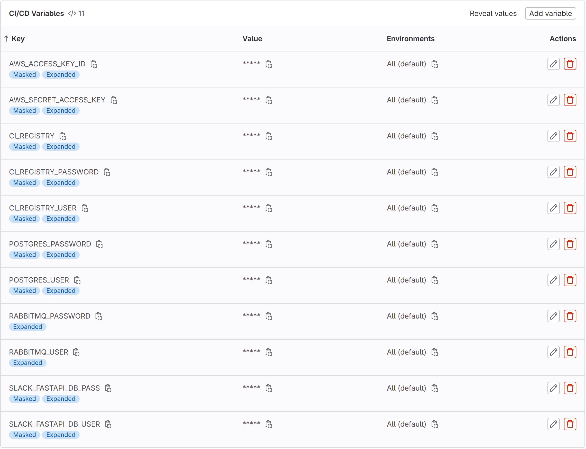

### replace redevops.io with proper domain and modify app.yml.j2 to use correct letsencrypt issuer, then push slackfastapi-master to gitlab
```
cd ../slackfastapi-master
git init --initial-branch=main # if needed
git remote set-url origin https://redevops.gitlab.yandexcloud.net/slackfastapi/slackfastapi.git

# check
git remote -v
eval "$(ssh-agent -s)"
ssh-add ~/.ssh/tumblebuns

# change remote url to use ssh:
git remote set-url origin git@redevops.gitlab.yandexcloud.net:slackfastapi/slackfastapi.git
git push -u origin main
```

### additional settings should be set in .env file (as .gitlab-ci.yml expects this file to exist)
```
# General FastAPI settings
SLACK_FASTAPI_RELOAD="True"
SLACK_FASTAPI_PORT="8000"
SLACK_FASTAPI_ENVIRONMENT="dev"

# Database settings (modify with your database credentials)
SLACK_FASTAPI_DB_HOST="slack_fastapi-db"  # Use the service name of the database in docker-compose.yml
SLACK_FASTAPI_DB_PORT="5432"              # Same as in docker-compose.yml
SLACK_FASTAPI_DB_NAME="slack_fastapi"     # Same as POSTGRES_DB in docker-compose.yml

# Additional settings (if any) based on your application's `settings.py`, for example:
# SLACK_FASTAPI_API_KEY="your_api_key_value"
```
### Under Project -> Build -> Pipelines: a new pipeline should be triggered. Additional stages can be run manually
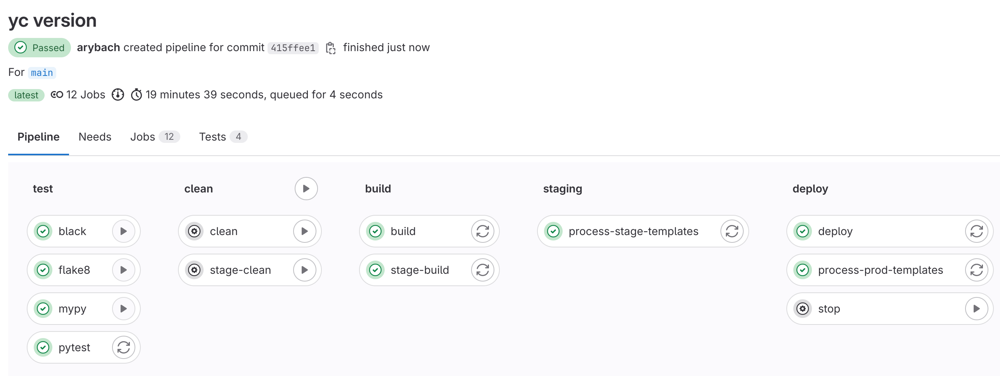

### and the fastapi app pods should be up and runnig:
```
 kubectl get pods -n slack-fastapi                               
NAME                                 READY   STATUS    RESTARTS        AGE
slack-fastapi-app-67868cfc-6pbzv     1/1     Running   0               5m56s
slack-fastapi-app-67868cfc-jwgp9     1/1     Running   0               5m56s
slack-fastapi-db-7bbb4f5cd7-lpptk    1/1     Running   0               5m57s
slack-fastapi-rmq-848b5f655b-n5sfw   1/1     Running   0               5m56s
```

### deploy traefik ingress controller - fetch and base64 encode api token from DO, then place it in traefik-certs-do.yml
### for YC: add reserved IP from terraform output to traefik-certs-yc.yml under spec: loadBalancerIP: 158.160.35.194 or comment it out to generate a new one
```
cd ../ansible
# for do
ansible-playbook deploy-traefik-do.yml
# for yc
ansible-playbook deploy-traefik-yc.yml

# fetch external ip:
% kubectl get svc -n traefik
NAME              TYPE           CLUSTER-IP      EXTERNAL-IP      PORT(S)                      AGE
traefik-ingress   LoadBalancer   10.245.25.142   139.59.217.202   80:31132/TCP,443:30207/TCP   39m

# then modify DNS records for *.redevops.io to point to it (if different from terraform's output in yc case), redevops.io should still point to gitlab's external ip
``` 

### before deploying monitoring to enable alerts create apikey with sendgrid.com, export it as SEND_GRID_SMTP_TOKEN env var:
```
export SEND_GRID_SMTP_TOKEN=sgtoken
# make sure AWS_ACCESS_KEY_ID and AWS_SECRET_ACCESS_KEY are exported as well
```
### deploy monitoring (modify deploy-monitoring.yml to use monitoring-do.yml or monitoring-yc.yml):
```
cd ../ansible
ansible-playbook deploy-monitoring.yml

# to fetch credentials:
% kubectl get secrets -n prometheus

NAME                                                                TYPE                 DATA   AGE
alertmanager-kube-prom-stack-kube-prome-alertmanager                Opaque               1      4h53m
alertmanager-kube-prom-stack-kube-prome-alertmanager-generated      Opaque               1      4h53m
alertmanager-kube-prom-stack-kube-prome-alertmanager-tls-assets-0   Opaque               0      4h53m
alertmanager-kube-prom-stack-kube-prome-alertmanager-web-config     Opaque               1      4h53m
kube-prom-stack-grafana                                             Opaque               3      4h53m
kube-prom-stack-kube-prome-admission                                Opaque               3      4h53m
kube-prom-stack-kube-prome-prometheus                               Opaque               0      4h53m
prometheus-kube-prom-stack-kube-prome-prometheus                    Opaque               1      4h53m
prometheus-kube-prom-stack-kube-prome-prometheus-tls-assets-0       Opaque               1      4h53m
prometheus-kube-prom-stack-kube-prome-prometheus-web-config         Opaque               1      4h53m
sh.helm.release.v1.kube-prom-stack.v1                               helm.sh/release.v1   1      4h53m

# password for grafana
% kubectl get secret kube-prom-stack-grafana -n prometheus -o jsonpath="{.data.admin-password}" | base64 --decode ; echo
```
### in Grafana setup data sources:
Prometheus server URL: http://kube-prom-stack-kube-prome-prometheus:9090
Loki URL: http://loki-gateway:80

### port-forward prometheus service to check alerting rules and data sources
```
kubectl port-forward svc/kube-prom-stack-kube-prome-prometheus -n prometheus 9090
```
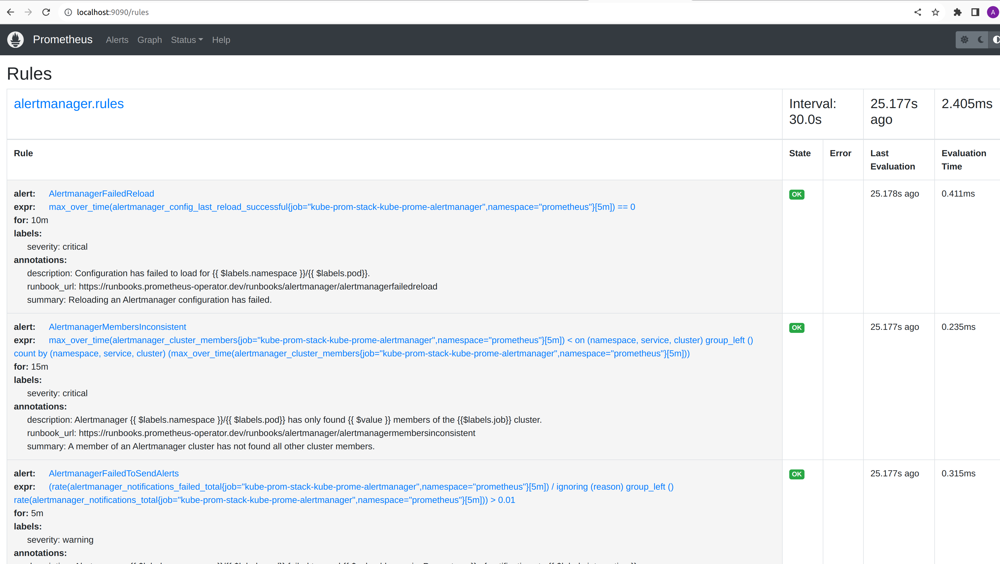

### targets
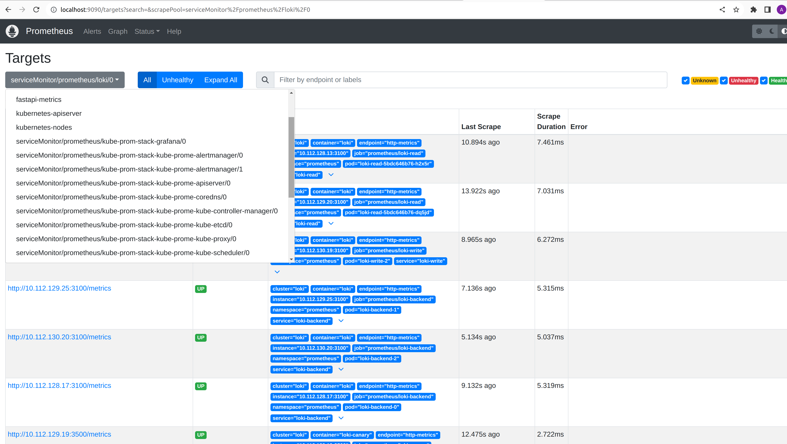

### navigate to https://grafana.redevops.io and login with admin and password from above (can be set in deploy-monitoring.yml)

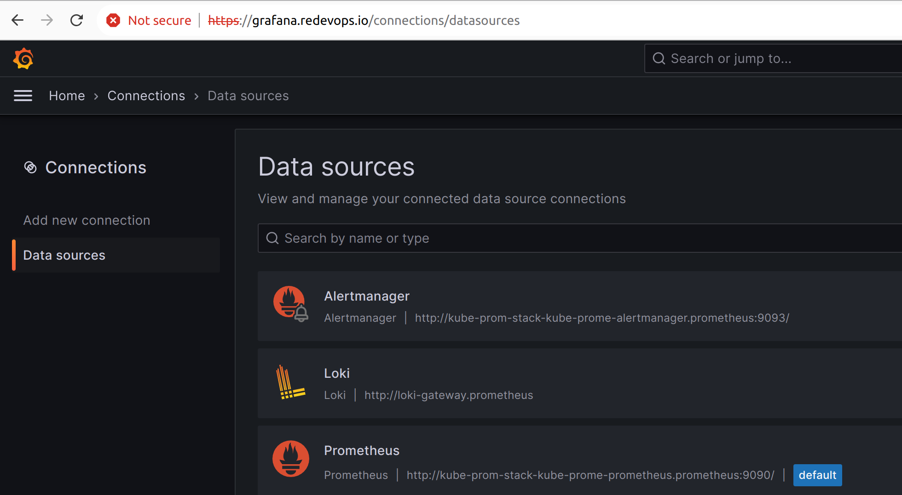

### check api docs: https://api.redevops.io/api/docs

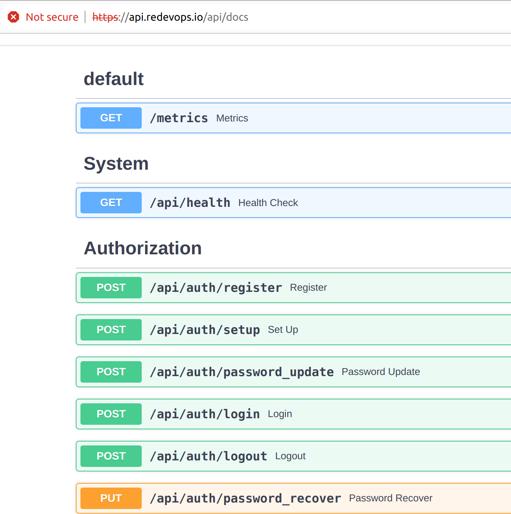

